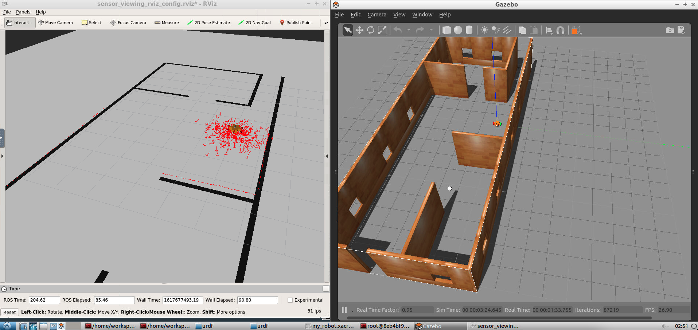
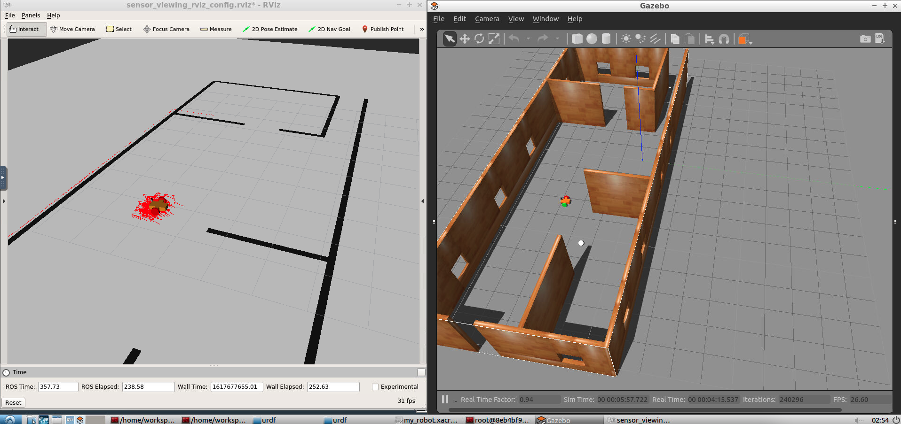

Udacity Robotics Nanodegree
------------------

Project 3: Where-Am-I
------------------
Here is the robot in the initial position without localized particles:

Here is the robot localized:

Here is a link to the video:

[localization video](https://github.com/Wubuntu88/UdacityRobotics-Where-am-I/blob/master/robot_localization.mov)
### Overview
This project will use AMCL to localize a robot, using the robot and world defined in the previous project.
It can localize using the teleop node and typing via the keyboard to move it.

## Project Setup

#### Setup scripts for the container:
```
sudo apt-get update && sudo apt-get upgrade -y
sudo apt-get install ros-kinetic-navigation
sudo apt-get install ros-kinetic-map-server
sudo apt-get install ros-kinetic-move-base
sudo apt-get install ros-kinetic-amcl
sudo apt-get install libignition-math2-dev protobuf-compiler
source /opt/ros/kinetic/setup.bash
```

Navigate to the home directory in a terminal.  
Issue the following commands to create a catkin workspace:
```
mkdir -p catkin_ws/src
cd catkin_ws/src
catkin_init_workspace
```

Next, download the github repository:

```
cd catkin_ws/
git clone https://github.com/Wubuntu88/UdacityRobotics-map-my-world.git
rm -rf UdacityRobotics-map-my-world/udacity_robot/
rm -rf UdacityRobotics-map-my-world/my_robot

cp -R -f UdacityRobotics-map-my-world/my_robot src/
```

Build the catkin workspace:
```
cd ..
catkin_make
```

Setup the teleop node:
```
cd /home/workspace/catkin_ws/src
git clone https://github.com/ros-teleop/teleop_twist_keyboard
cd ..
catkin_make
source devel/setup.bash
rosrun teleop_twist_keyboard teleop_twist_keyboard.py
```

You must start two programs to run the system.  This is done in two different terminals.
1) The Gazebo World (RViz will also start)
```
cd catkin_ws/
source devel/setup.bash
roslaunch my_robot wooden_house_world.launch
```
2) The AMCL node
```
cd catkin_ws/
source devel/setup.bash
roslaunch my_robot mapping.launch
roslaunch my_robot localization.launch
```

### Database Analysis
rtabmap-databaseViewer ~/.ros/rtabmap.db

### Project Structure
Here is the project structure in the src folder:
```
root@8eb4bf9c25fc:/home/workspace/catkin_ws/src# tree
.
|-- CMakeLists.txt -> /opt/ros/kinetic/share/catkin/cmake/toplevel.cmake
|-- my_robot
|   |-- CMakeLists.txt
|   |-- launch
|   |   |-- robot_description.launch
|   |   `-- world.launch
|   |-- mesh_files
|   |   `-- hokuyo.dae
|   |-- package.xml
|   |-- urdf
|   |   |-- materials.xacro
|   |   |-- my_robot.gazebo
|   |   `-- my_robot.xacro
|   `-- worlds
|       |-- myworld
|       |-- myworld_without_ball
|       |-- myworld_without_ball.world
|       |-- wooden_house.world
|       `-- wooden_house_with_ball.world
|-- pgm_map_creator
|   |-- CMakeLists.txt
|   |-- LICENSE
|   |-- README.md
|   |-- launch
|   |   `-- request_publisher.launch
|   |-- maps
|   |   |-- map
|   |   `-- map.pgm
|   |-- msgs
|   |   |-- CMakeLists.txt
|   |   `-- collision_map_request.proto
|   |-- package.xml
|   |-- src
|   |   |-- collision_map_creator.cc
|   |   `-- request_publisher.cc
|   `-- world
|       |-- myworld_without_ball
|       |-- udacity_mtv
|       `-- wooden_house.world
|-- teleop_twist_keyboard
|   |-- CHANGELOG.rst
|   |-- CMakeLists.txt
|   |-- README.md
|   |-- package.xml
|   `-- teleop_twist_keyboard.py
`-- udacity_robot
    |-- CMakeLists.txt
    |-- config
    |   |-- base_local_planner_params.yaml
    |   |-- costmap_common_params.yaml
    |   |-- global_costmap_params.yaml
    |   |-- local_costmap_params.yaml
    |   `-- sensor_viewing_rviz_config.rviz
    |-- launch
    |   |-- amcl.launch
    |   `-- wooden_house_world.launch
    |-- maps
    |   |-- original_map.pbm
    |   |-- wooden_house_map.pbm
    |   `-- wooden_house_map.yaml
    `-- package.xml

17 directories, 44 files
```