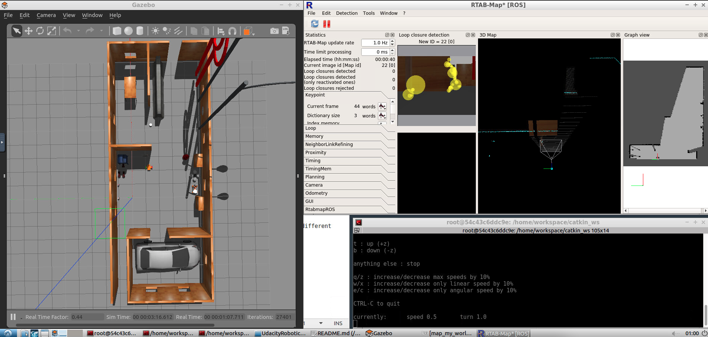
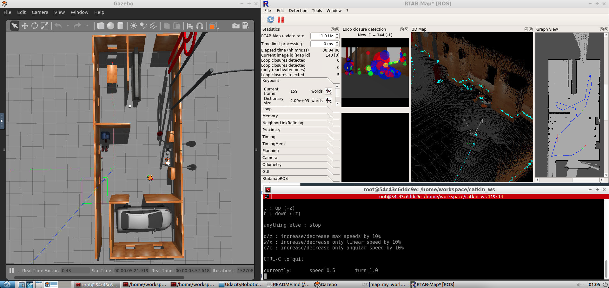
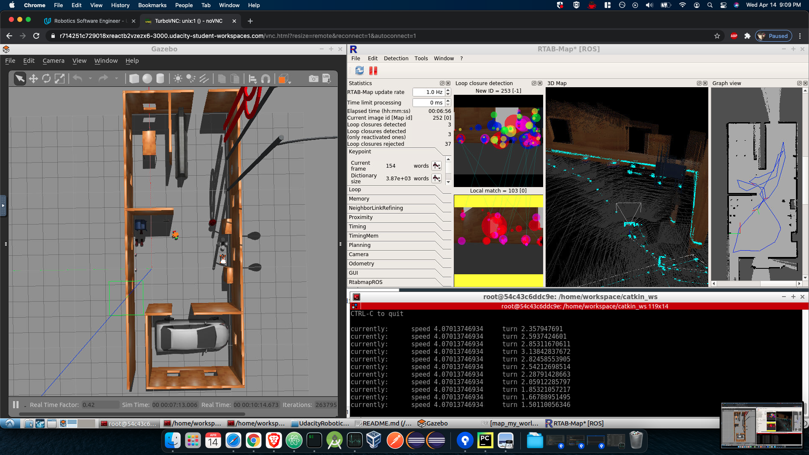
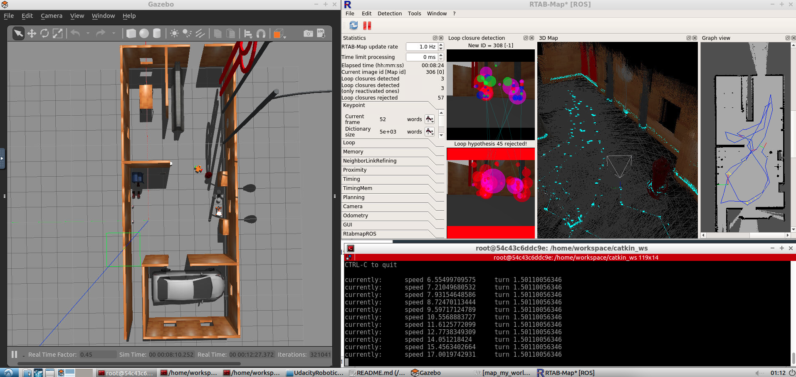
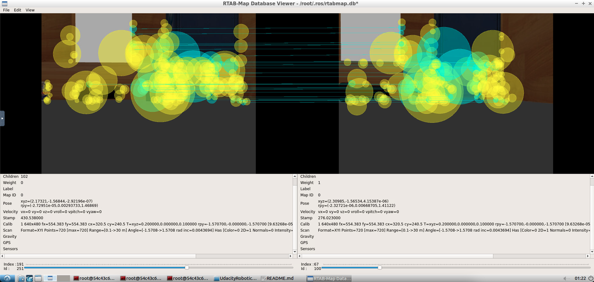
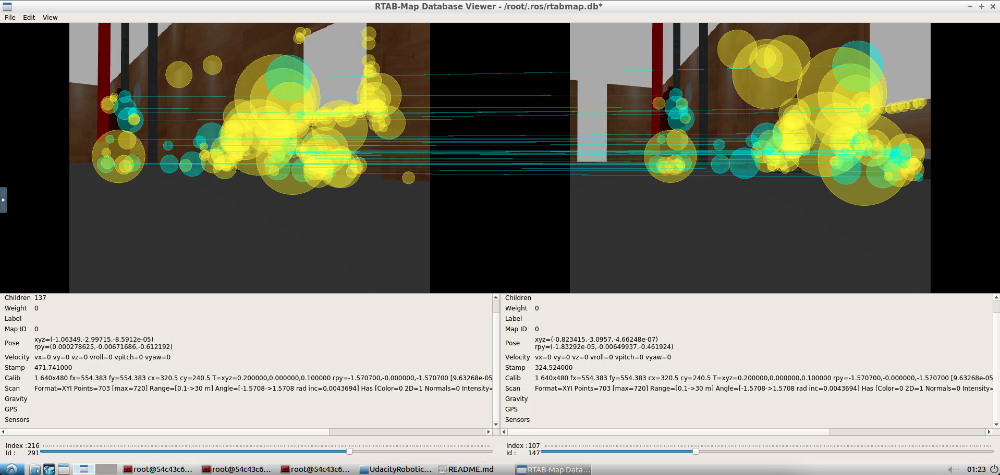

Udacity Robotics Nanodegree
------------------

Project 4: Map My World
------------------

### Overview
This project uses the RTAB-MAP ros package to map out the gazebo world of the previous projects.
The teleop ros package is used to move the robot in the gazebo project, 
and the RTAB-MAP package will map out the area as the robot moves through it.

In the project run, the robot is moved around the environment via teleop, 
and RTAB-MAP recognizes features of different landmards (postbox, mailbox, quad rotor, etc).
When there is a feature that is recognized as being seen again, there is a 'loop closure'.

Below are instructions to start the project in the Udacity workspace.
There are also screenshots of the project as the run of the robot progressed.

## Project Setup

#### Setup scripts for the container:
```
sudo apt-get update && sudo apt-get upgrade -y
sudo apt-get install ros-kinetic-navigation
sudo apt-get install ros-kinetic-map-server
sudo apt-get install ros-kinetic-move-base
sudo apt-get install ros-kinetic-amcl
sudo apt-get install libignition-math2-dev protobuf-compiler
source /opt/ros/kinetic/setup.bash
```

Navigate to the home directory in a terminal.  
Issue the following commands to create a catkin workspace:
```
mkdir -p catkin_ws/src
cd catkin_ws/src
catkin_init_workspace
```

Next, download the github repository:

```
cd catkin_ws/
git clone https://github.com/Wubuntu88/UdacityRobotics-map-my-world.git
rm -rf src/my_robot
cp -R -f UdacityRobotics-map-my-world/my_robot src/
```

Build the catkin workspace:
```
cd ..
catkin_make
```

Setup the teleop node:
```
cd /home/workspace/catkin_ws/src
git clone https://github.com/ros-teleop/teleop_twist_keyboard
cd ..
catkin_make
source devel/setup.bash
rosrun teleop_twist_keyboard teleop_twist_keyboard.py
or
roslaunch my_robot teleop.launch
```

You must start two programs to run the system.  This is done in two different terminals.
1) The Gazebo World (RViz will also start)
```
cd catkin_ws/
source devel/setup.bash
roslaunch my_robot wooden_house_world.launch
```

2) The mapping node
```
cd catkin_ws/
source devel/setup.bash
roslaunch my_robot mapping.launch
roslaunch my_robot localization.launch
```

### Database Analysis

Here is the rtabmap database file: https://drive.google.com/file/d/12Ni1OEAid9l5qRj1225bOv0_ohx1f6sS/view?usp=sharing

Copy it to a location in the workspace and view it like so:

```
rtabmap-databaseViewer home/workspace/rtabmap.db
```


# Images of the project:
Here is the robot in the initial position:

Here is the robot having explored the map:

Here is the robot with a local match:

Here is the robot with a loop closure rejection:

Here is the robot with the post box being recognized again in a second position:

Here is the robot with the quad rotor being recognized again in a second position:


### Project Structure
The project is in the my_robot folder and the database is in this link: https://drive.google.com/file/d/12Ni1OEAid9l5qRj1225bOv0_ohx1f6sS/view?usp=sharing

Here is the project structure from the top level folder:
```
(base) will-MBP ~/Desktop/UdacityRobotics/UdacityRobotics-map-my-world$:tree
(base) will-MBP ~/Desktop/UdacityRobotics/UdacityRobotics-map-my-world$:tree
.
├── README.md
├── images
│   ├── 1_initial_position.png
│   ├── 2_map_explored.png
│   ├── 3_local_match.png
│   ├── 4_loop_rejection.png
│   ├── 5_post_box_match.png
│   └── 6_quadrotor_match.png
├── model_decorated
│   ├── model.config
│   └── model.sdf
├── my_robot
│   ├── CMakeLists.txt
│   ├── launch
│   │   ├── localization.launch
│   │   ├── mapping.launch
│   │   ├── robot_description.launch
│   │   ├── teleop.launch
│   │   ├── wooden_house_world.launch
│   │   └── world.launch
│   ├── map_my_world_config.rviz
│   ├── mesh_files
│   │   └── hokuyo.dae
│   ├── package.xml
│   ├── urdf
│   │   ├── materials.xacro
│   │   ├── my_robot.gazebo
│   │   └── my_robot.xacro
│   └── worlds
│       ├── myworld
│       ├── myworld_without_ball.world
│       ├── wooden_house.world
│       ├── wooden_house_with_ball.world
│       └── wooden_house_world_decorated.world
└── startup_notes.txt
```