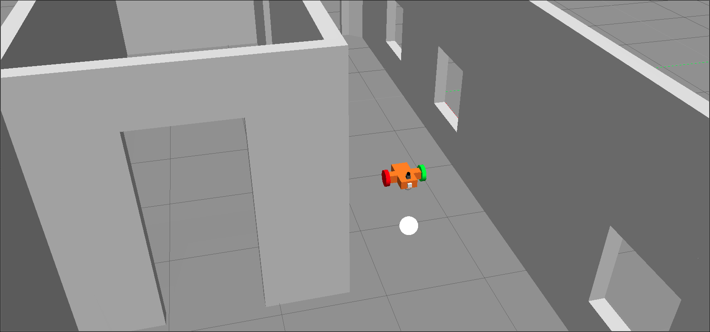

Udacity Robotics Nanodegree
------------------

Project 2: Go Chase It
------------------

### Overview
This project will drive a robot to chase a white ball.

### Project Setup

Navigate to the home directory in a terminal.  
Issue the following commands to create a catkin workspace:
```
mkdir -p catkin_ws/src
cd catkin_ws/src
catkin_init_workspace
```

Next, download the github repository:

```
git clone https://github.com/Wubuntu88/UdacityRobotics-myrobot.git
cp -R UdacityRobotics-myrobot/ball_chaser ball_chaser
cp -R UdacityRobotics-myrobot/my_robot my_robot
```

Build the catkin workspace:
```
cd ..
catkin_make
```

You must start two programs to run the system.  This is done in two differenct terminals.
1) The Gazebo World
```
source devel/setup.bash
roslaunch my_robot world.launch
```
2) The ball_chaser node
```
source devel/setup.bash
roslaunch ball_chaser ball_chaser.launch
```

### Project Structure
Here is the project structure as listed in the project requirements:
```
.UdacityRobotics-myrobot                         # Go Chase It Project
├── my_robot                       # my_robot package                   
│   ├── launch                     # launch folder for launch files   
│   │   ├── robot_description.launch
│   │   ├── world.launch
│   ├── meshes                     # meshes folder for sensors
│   │   ├── hokuyo.dae
│   ├── urdf                       # urdf folder for xarco files
│   │   ├── my_robot.gazebo
│   │   ├── my_robot.xacro
│   ├── world                      # world folder for world files
│   │   ├── my_world
│   ├── CMakeLists.txt             # compiler instructions
│   ├── package.xml                # package info
├── ball_chaser                    # ball_chaser package                   
│   ├── launch                     # launch folder for launch files   
│   │   ├── ball_chaser.launch
│   ├── src                        # source folder for C++ scripts
│   │   ├── drive_bot.cpp
│   │   ├── process_images.cpp
│   ├── srv                        # service folder for ROS services
│   │   ├── DriveToTarget.srv
│   ├── CMakeLists.txt             # compiler instructions
│   ├── package.xml                # package info                  
└──                      
```